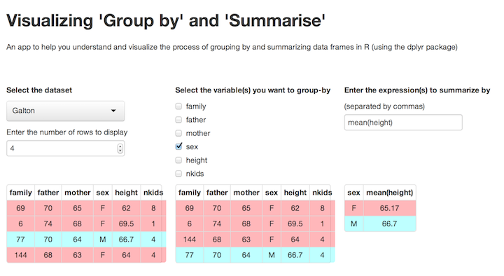

To help you see what's going on in some of the `dplyr` operations, Barbara Borges Ribiero has written some interactive "apps."  Here's a (non-interactive) picture of one.



## Before you start

This app uses the `shiny` package in R. (You don't need to know anything about `shiny`.)
```
require(shiny)
```

## The Three Apps

### Join

Give this command on the RStudio Server or a Mac Desktop running R locally.  **If you are on a PC** the name should be `"joinpc"`.
```
shiny::runGitHub("shiny", "bborgesr", subdir = "join")
```

### Group

On all platforms:

```
shiny::runGitHub("shiny", "bborgesr", subdir = "group")
```

### Interactive Rmd Editing


```
shiny::runGitHub("shiny", "bborgesr", subdir = "rmd")
```

This will open a file browser.  If you are on the server, it may be hidden behind your web browser, so look there.

The heart of this app is from Yihui Xie.