```{r include=FALSE}
require(mosaic)
require(DCFdevel)
require(knitr)
require(mapprojector)
# require(plyr) # just for the line example: KILL this
opts_chunk$set(echo=FALSE,tidy=FALSE,warning=FALSE,message=FALSE)
library(maps)
#load us map data
all_states <- map_data("state")
data(CPS85, package='mosaic')
```


## Grammar?

The conventional interface to graphics is like a sentence:

Do this          | to that.
-----------------|---------
  **What**       | **variables **
Make scatterplot | height, age.

But different types of graphics are often combined, e.g.:

* scatterplot, with groups connected
* heatmap, with dendrogram
* barchart, with error bars


## Parts of ~~~Speech~~~ *Graphics*

* **Frame**
* **Layer**
* **Glyph**
* **Guide**
* **Facet**
* Scale
* Annotation
* Transform
* Statistic


## Glyph  (or Geom, or Mark)

A **glyph** is a graphical element that conveys information:

  | 
--------------------------|-------------------------------
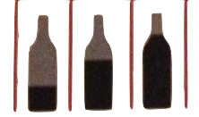 | 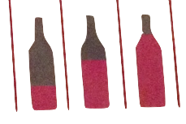

## Some Glyphs

```{r}
D <- data.frame( x=c(1,2,3),y=c(1,1.2,0.8),z=5+c(2,1,1.5),Agree=c('Yes','No','No'),Gender=c('F','M','M'))
P <- ggplot(D, aes(x=x,y=y,color=Agree,shape=Gender)) + xlim(.5,3.5) + ylim(.5,1.5) + xlab('') + ylab('')

  
Blank <- theme(axis.text.x = element_blank(),
                    axis.text.y = element_blank(),
                    panel.background=element_blank(),
                    panel.grid=element_blank(),
                    axis.text=element_blank(),
                    axis.ticks=element_blank()) 

```

## Points

```{r}
P + geom_point(aes(size=z))  + Blank
```

## Bars
```{r}
ggplot(diamonds, aes(cut, fill=cut)) + xlab('') + ylab('') + geom_bar() + Blank
```

##Paths
```{r eval=FALSE}
myear <- ddply(movies, .(year), colwise(mean, .(length, rating)))
p <- ggplot(myear, aes(length, rating))
p + geom_path(aes(colour = year))
```

## Frames

A piece of two-dimensional space.

* Defined by two variables.

The variables can be either quantitative, categorical, or ordinal.

## Quantitative vs Categorical
```{r}
ggplot(CPS85,aes(x=sector,y=wage)) + geom_blank()
```

## Quantitative vs Quantitative

```{r}
ggplot(NHANES,aes(x=height,y=age)) + geom_blank()
```

## Categorical vs Categorical 
```{r}
data(Minneapolis2013)
Minneapolis2013 %>% 
  group_by(First) %>%
  filter( n() > 5000) -> tmp
ggplot(tmp, aes(x=Ward, y=First )) + geom_blank()
```

## Guides

A **guide** helps the human reader of a chart to ascertain the value of a variable for each case.

$x$- and $y$- axis are usual.

* The number line is ordered.
* Quantitative variables have a natural order.
* Categorical variables do not.  So an order must be specified.
    * Alphabetical is often used, but not often useful.
    
## Other sorts of guides

* Color
* Size
* Shape
* Transparency

These are graphical attributes reflected in glyphs.  The guide tells you how the attribute is related to the value or level of the corresponding variable.

A guide is the displayed manifestation of a **scale**.  The scale translates the variable into a graphical attribute.

## Example

```{r eval=FALSE}
CPS85 %>% group_by(sector,union) %>% 
  summarize(Wage=mean(wage),Variation=sd(wage),Union=union[1],Sector=sector[1]) -> tmp
ggplot( tmp, aes(x=Sector,y=Union,size=Wage,color=Variation)) +
         geom_point()
```

## Example

```{r}
data(ZipDemography)
data(ZipGeography)
ZIP <- inner_join(ZipGeography, ZipDemography, by='ZIP') %>%
  mutate(Elderly=X65yearsandover/Totalpopulation) %>% arrange(Elderly)

p <- ggplot( ZIP, aes(x=Longitude, y=Latitude, color=Elderly,size=Elderly )) +
  geom_point(aes(alpha=Elderly>0.2)) + xlim(-125,-70) + ylim(24,50)
p
```

## Layers

Let's add some new data in a new layer: the shape of states.
```{r}
p + geom_polygon( data=all_states, aes(x=long, y=lat, group = group,order=order),size=.3,colour="white", fill=NA ) + 
  coord_map(projection="polyconic")
```

## Dynamite

```{r}
CPS85 %>% group_by(sector,sex) %>% 
  summarize(Mean=mean(wage),
            SE=2*sd(wage)/sqrt(length(wage))
            ) -> means

P1 <- ggplot(data=means, aes(x=sector,y=Mean,group=sex)) +
    geom_bar(data=means,stat='identity',
             position='dodge',alpha=0.2,aes(fill=sex)) + ylab('Wage ($/hr)')

P2 <- P1 + geom_errorbar(data=means,aes(ymax=Mean+SE,ymin=Mean-SE),
                  width=0.2,position=position_dodge(width=0.8))
  
P3 <- P2 + geom_point(data=CPS85,
                        position=position_dodge(width=1.2),
                        aes(y=wage,color=sex),alpha=.3)
P1
```

## Second Layer

```{r}
P2
```

## Third Layer

```{r}
P3
```

## Fixing up

```{r}
P3 + coord_flip() + ylim(0,26)
```

## Example 1 

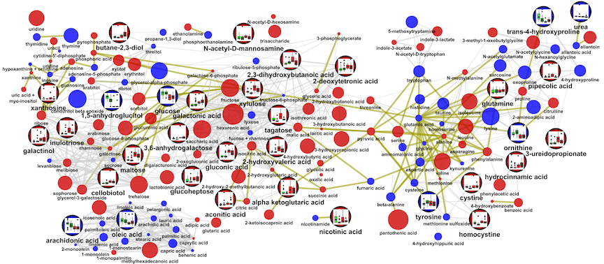

[Source](http://imdevsoftware.files.wordpress.com/2013/02/network_2.png)

## Example 2

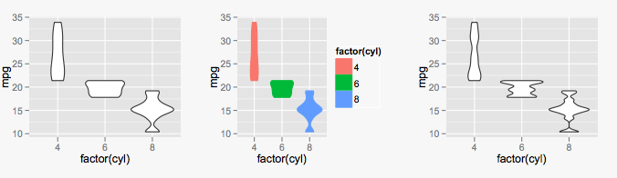

[Source](http://revolution-computing.typepad.com/.a/6a010534b1db25970b01676348fe97970b-pi)

## Example 3

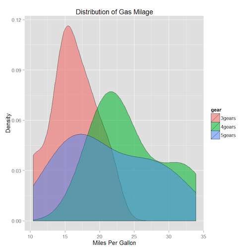

[Source](http://www.statmethods.net/advgraphs/images/ggplotdensity.png)

## Example 4

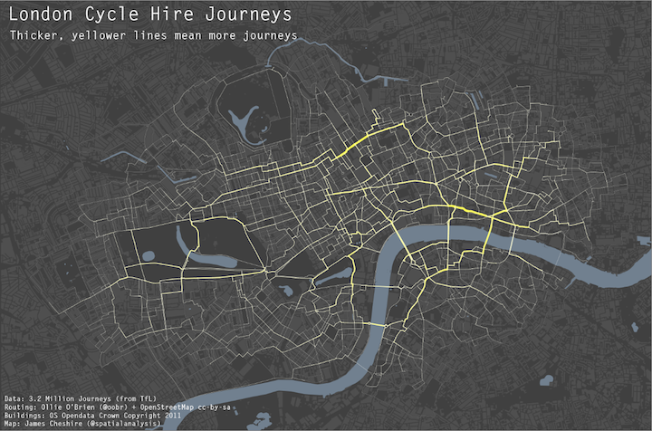

[Source](http://spatialanalysis.co.uk/wp-content/uploads/2012/02/bike_ggplot.png)

## Example 5

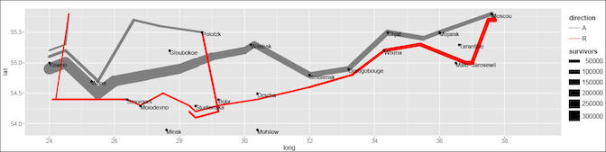

[Source](http://www.datavis.ca/gallery/minard/ggplot2/march.jpg)

## Example 6

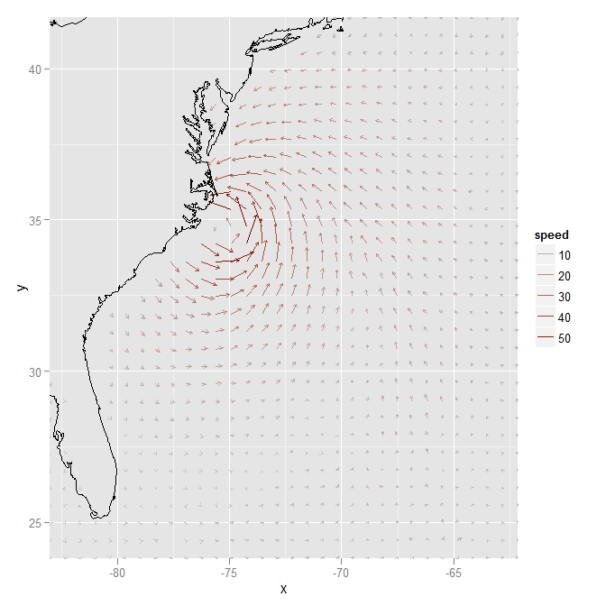

[Source](http://revolution-computing.typepad.com/.a/6a010534b1db25970b017d40f80f62970c-800wi)

## Example 7

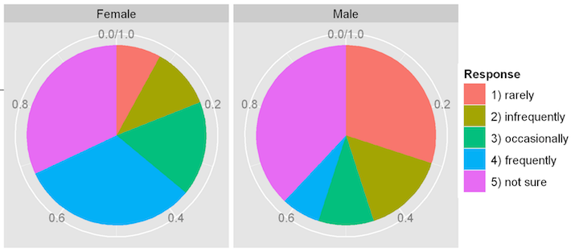

[Source](http://www.r-bloggers.com/wp-content/uploads/2010/07/pie_chart3.png)

## Example 8

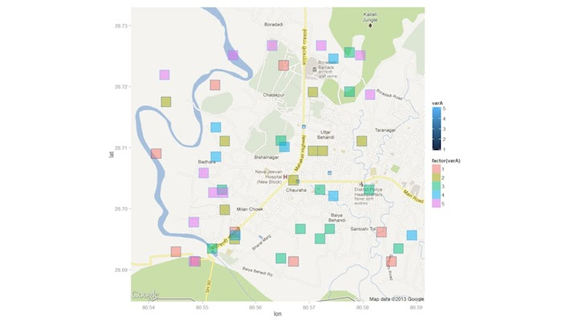

[Source](http://3.bp.blogspot.com/-6mec7RMLKIY/UW1RM9Sl44I/AAAAAAAAFCw/BOcYCpd-XqM/s1600/jkkakaslsls.jpeg)

## Example 9

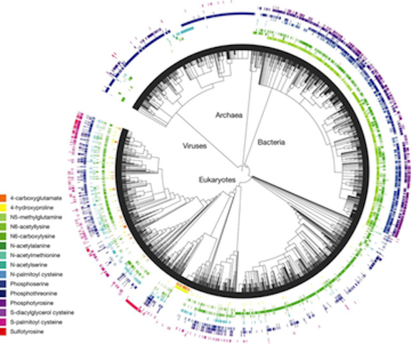
