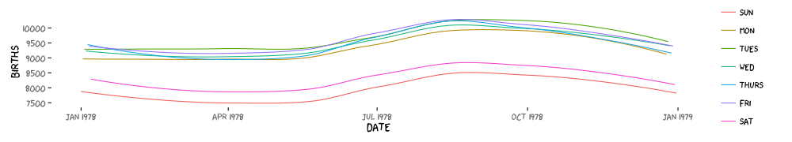

```{r include=FALSE}
require(ggplot2)
require(dplyr)
require(mosaic)
require(knitr)
require(ggthemes)
opts_chunk$set(
  message=FALSE,
  warning=FALSE,
  size='small',
  tidy=FALSE
  )
require(lubridate)
require(sysfonts)
require(xkcd)
options(width=65)
```


Goals
=====

What I will try to do

 * give a tour of `ggplot2`
 
 * explain how to think about plots the `ggplot2` way
 
 * prepare/encourage you to learn more later
 
What I can't do in one session

 * show every bell and whistle
 
 * make you an expert at using `ggplot2`


The Births78 data set -- revised edition
================
```{r}
require(dplyr)
require(mosaic)
require(lubridate)
Births2 <- Births78 %>% 
  mutate( 
    date = mdy(date) - years(100),  # y2k fix
    wd = wday(date),                # as a number
    wday = wday(date, label=TRUE, abbr=TRUE)   # as text (abbrev)
  )
head(Births2, 2)
```


The grammar of graphics
=======================

**geom**: the geometric "shape" used to display data (glyph)
 
 * bar, point, line, ribbon, text, etc.
 
**aesthetic**: an attribute controlling how geom is displayed

 * x position, y position, color, fill, shape, size, etc.

**stat**: a transformation applied to data before geom gets it

 * example: histograms work on binned data
 
**scale**: conversion of raw data to visual display

 * particular assignment of colors, shapes, sizes, etc. 
 
**guide**: helps user convert visual data back into raw data (legends, axes)

How do we make this plot?
=========================

```{r, echo=FALSE}
ggplot(data=Births2, aes(x=date, y=births)) + geom_point()
```

\pause

What does R need to know?

\pause

* data source 

* aesthetics 

* geom -- dots


How do we make this plot?
=========================

```{r, echo=FALSE, fig.height=1.5}
ggplot(data=Births2, aes(x=date, y=births)) + geom_point()
```

What does R need to know?
\pause

* data frame containing the data: `ggplot(data=)`
```{r, eval=FALSE}
ggplot(data=Births2)
```

\pause
* how we want to map our aesthetics: `aes()`
```{r, eval=FALSE}
ggplot(data=Births2, aes(x=date, y=births)) 
```
\pause

* what geom we want to use: `+ geom_point()`

```{r, eval=FALSE}
ggplot(data=Births2, aes(x=date, y=births)) + geom_point()
```


How do we make this plot?
====================

```{r, echo=FALSE}
ggplot(data=Births2, aes(x=date, y=births, color=wday)) + geom_point()
```

What information has changed?  \pause

* new aesthetic: mapping color to day of week

```{r, eval=FALSE}
ggplot(data=Births2, aes(x=date, y=births, color=wday)) + 
  geom_point()
```

How do we make this plot?
====================

```{r, echo=FALSE}
ggplot(data=Births2, aes(x=date, y=births, color=wday)) + 
  geom_line()
```

\pause

This time we use lines instead of dots

```{r, eval=FALSE}
ggplot(data=Births2, aes(x=date, y=births, color=wday)) + 
  geom_line()
```

How do we make this plot?
====================

```{r, echo=FALSE}
ggplot(data=Births2, aes(x=date, y=births, color=wday)) + 
  geom_point() + 
  geom_line()
```

\pause

This time we have two **layers**, one with points and one with
lines

```{r, eval=FALSE}
ggplot(data=Births2, 
       aes(x=date, y=births, color=wday)) + 
  geom_point() + 
  geom_line()
```
\pause

*  The layers are placed one on top of the other:  the points 
are *below* and the lines are *above*.   Sometimes the order of 
the layers can be important because of overplotting.

Alternative Syntax
===================

```{r}
Births2 %>% 
  ggplot(aes(x=date, y=births, color=wday)) + 
  geom_point() + 
  geom_line()
```

What does this do?
=============

```{r, eval=FALSE}
Births2 %>%
  ggplot(aes(x=date, y=births, color="navy")) + 
  geom_point()  
```

\pause

```{r, echo=FALSE}
Births2 %>% 
  ggplot(aes(x=date, y=births, color="navy")) + 
  geom_point()  
```

This is *mapping* the color aesthetic to a new variable with only one
value ("navy").  So all the dots get set to the same color, but it's
not navy.

Setting vs. Mapping
============

If we want to *set* the color to be navy for all of the dots, we do 
it this way:

```{r}
Births2 %>%
  ggplot(aes(x=date, y=births)) +   # map these 
  geom_point(color = "navy")        # set this
```

* Note that `color = "navy"` is now outside of the aesthetics list.  That's how `ggplot2` distinguishes between mapping and setting.

How do we make this plot?
===========================

```{r, echo=FALSE}
Births2 %>%
  ggplot(aes(x=date, y=births)) + 
  geom_line(aes(color=wday)) +        # map color here
  geom_point(color="navy")            # set color here
```
\pause

```{r, eval=FALSE}
Births2 %>%
  ggplot(aes(x=date, y=births)) + 
  geom_line(aes(color=wday)) +       # map color here
  geom_point(color="navy")           # set color here
```

* `ggplot()` establishes the default data and aesthetics
for the geoms, but each geom may change these defaults.

* good practice: put into `ggplot()` the things that affect all (or most) of the layers; rest in `geom_blah()`

Other geoms
===========
```{r, echo=TRUE, comment=NA}
apropos("^geom_")
```

help pages will tell you their aesthetics and default stats

```{r, eval=FALSE}
?geom_area             # for example
```


Let's try geom_area
===============
```{r, eval=TRUE}
Births2 %>%
  ggplot(aes(x=date, y=births, fill=wday)) + 
  geom_area()
```

This is not a good plot
\pause

* overplotting is hiding much of the data
* extending y-axis to 0 may or may not be desirable.

Side note: what makes a plot good?
================

Most (all?) graphics are intended to help us make comparisons

* How does something change over time?
* Do my treatments matter?  How much?
* Do men and women respond the same way?

**Key plot metric:** Does my plot make the comparisions 
I am interested in 

* easily, and 
* accurately?

Time for some different data
============================

HELPrct: Health Evaluation and Linkage to Primary care randomized
clinical trial
```{eval=FALSE}
?HELPrct
```

Why are these people in the study?
==================================

```{r}
HELPrct %>% 
  ggplot(aes(x=substance)) + 
  geom_bar()
```

\pause

* Hmm.  What's up with `y`?
\pause

    * `stat_bin()` is being applied to the data before the 
    `geom_bar()` gets to do its thing.  Binning creates the
    `y` values.

Data Flow
=========

\[
\mbox{org data}
\stackrel{\mbox{\ stat\ }}{\longrightarrow}
\mbox{statified}
\stackrel{\mbox{aesthetics}}{\longrightarrow}
\mbox{aesthetic data}
\stackrel{\mbox{\ scales\ }}{\longrightarrow}
\mbox{scaled data}
\]

Simplifications:

 * aesthetics get computed twice, once before the stat and again after.   Examples: bar charts, histograms
 
* item we need to look at the aesthetics to figure out which variable 
   to bin 
   
    * then the stat does the binning
    * bin counts become part of the aesthetics for geom: `y=..count..`
    
* This process happens *in each layer*

* `stat_identity()` is the "do nothing" stat.


How old are people in the HELP study?
===============================

\pause
```{r, fig.height=1.5}
HELPrct %>% 
  ggplot(aes(x=age)) + 
  geom_histogram()
```

Notice the messages

* `stat_bin`:  Histograms are not mapping the raw data but
binned data.  
`stat_bin()` performs the data transformation.

* `binwidth`: a default binwidth has been selected, but we should
really choose our own.

Setting the binwidth manually
=============================

```{r}
HELPrct %>% 
  ggplot(aes(x=age)) + 
  geom_histogram(binwidth=2)
```


How old are people in the HELP study? -- Other geoms
===============================
```{r, fig.height=1.7}
HELPrct %>% 
  ggplot(aes(x=age)) + 
  geom_freqpoly(binwidth=2)
```

```{r, fig.height=1.7}
HELPrct %>% 
  ggplot(aes(x=age)) + 
  geom_density()
```

Selecting stat and geom manually
================================
Every geom comes with a default stat

* for simple cases, the stat is `stat_identity()` which does nothing
* we can mix and match geoms and stats however we like
```{r, fig.height=2.0}
HELPrct %>% 
  ggplot(aes(x=age)) + 
  geom_line(stat="density")
```

Selecting stat and geom manually
================================
Every stat comes with a default geom

* we can specify stats instead of geom, if we prefer
* we can mix and match geoms and stats however we like

```{r, fig.height=2.0}
HELPrct %>% 
  ggplot(aes(x=age)) + 
  stat_density( geom="line")
```

More combinations
=====================

```{r, fig.height=1.7}
HELPrct %>% 
  ggplot(aes(x=age)) + 
  geom_point(stat="bin", binwidth=3) + 
  geom_line(stat="bin", binwidth=3)  
```

```{r, fig.height=1.7}
HELPrct %>% 
  ggplot(aes(x=age)) + 
  geom_area(stat="bin", binwidth=3)  
```

```{r}
HELPrct %>% 
  ggplot(aes(x=age)) + 
  geom_point(stat="bin", binwidth=3, aes(size=..count..)) +
  geom_line(stat="bin", binwidth=3) 
```

Your turn:  How much do they drink? (i1)
===================

Create a plot that shows the distribution of the average daily
alcohol consumption in the past 30 days (`i2`).

How much do they drink? (i1)
===================

```{r, fig.height=1.5}
HELPrct %>% 
  ggplot(aes(x=i1)) +  geom_histogram()
```
```{r, fig.height=1.5}
HELPrct %>% 
  ggplot(aes(x=i1)) +  geom_area(stat="density")
```

Covariates: Adding in more variables
========================

Q. How does alcohol consumption (or age, your choice)
differ by sex and substance (alcohol, cocaine, heroin)?

Decisions:

* How will we display the variables: 
`i1` (or `age`), `sex`, `substance`

* What comparisons are we most interested in?

Give it a try.

* Note: I'm cheating a bit.  You may want to do some things
I haven't shown you yet.  (Feel free to ask.)

Covariates: Adding in more variables
========================

Using color and linetype:

```{r, fig.height=1.6}
HELPrct %>% 
  ggplot(aes(x=i1, color=substance, linetype=sex)) + 
  geom_line(stat="density")
```

Using color and facets

```{r, fig.height=1.6}
HELPrct %>% 
  ggplot(aes(x=i1, color=substance)) + 
  geom_line(stat="density") + facet_grid( . ~ sex )
```

Boxplots 
========================
Boxplots use `stat_quantile()` 
which computes a five-number summary 
(roughly the five quartiles of the data) and uses them to define a 
"box" and "whiskers".
The quantitative variable must be `y`, and there must be an 
additional `x` variable. 

```{r}
HELPrct %>% 
  ggplot(aes(x=substance, y=age, color=sex)) + 
  geom_boxplot()
```

Horizontal boxplots
===================
Horizontal boxplots 
are obtained by flipping the coordinate system:
```{r}
HELPrct %>% 
  ggplot(aes(x=substance, y=age, color=sex)) + 
  geom_boxplot() +
  coord_flip()
```

* `coord_flip()` may be used with other plots as well to reverse the roles
of `x` and `y` on the plot.

Give me some space
==================
We've triggered a new feature: `dodge` (for dodging things left/right).
We can control how much if we set the dodge manually.

```{r}
HELPrct %>% 
  ggplot(aes(x=substance, y=age, color=sex)) + 
  geom_boxplot(position=position_dodge(width=1)) 
```


Issues with bigger data
=========

```{r}
dim(NHANES)
NHANES %>%  ggplot(aes(x=waist, y=weight)) +
  geom_point() + facet_grid( sex ~ pregnant )
```

* Although we can see a generally positive association (as we would 
expect), the overplotting may be hiding information.

Using alpha (opacity)
=========

One way to deal with overplotting is to set the opacity low.

```{r}
NHANES %>% 
  ggplot(aes(x=waist, y=weight)) +
  geom_point(alpha=0.01) + facet_grid( sex ~ pregnant )
```

geom_density2d
==============
Alternatively (or simultaneously) we might prefere a different 
geom altogether.

```{r}
NHANES %>% 
  ggplot(aes(x=waist, y=weight)) +
  geom_density2d() + facet_grid( sex ~ pregnant )
```


geom_hex
==============
```{r}
NHANES %>% 
  ggplot(aes(x=waist, y=weight)) +
  geom_hex() + facet_grid( sex ~ pregnant )
```

Multiple layers
===============

```{r}
ggplot( data=HELPrct, aes(x=sex, y=age)) +
  geom_boxplot(outlier.size=0) +
  geom_jitter(alpha=.6) +
  coord_flip()
```

Labeling
========

```{r}
NHANES %>% 
  ggplot(aes(x=waist, y=weight)) +
  geom_hex() + facet_grid( sex ~ pregnant ) +
  labs(x="waist (m)", y="weight (kg)", title="weight vs waist")
```

Things I haven't mentioned (much)
=================================

 * scales (fine tuning mapping from data to plot)
 
 * guides (so reader can map from plot to data)
 
 * coords (`coord_flip()` is good to know about)
 
 * themes (for customizing appearance)

```{r, fig.width=14}
require(ggthemes)
qplot( x=date, y=births, data=Births2) + theme_wsj()
```

Things I haven't mentioned (much)
=================================

 * scales (fine tuning mapping from data to plot)
 
 * guides (so reader can map from plot to data)
 
 * coords (`coord_flip()` is good to know about)
 
 * themes (for customizing appearance)

```{r, eval=FALSE, fig.width=14}
require(xkcd)
qplot( x=date, y=births, data=Births2, color=wday, 
       geom="smooth", se=FALSE) +
  theme_xkcd()
```


Things I haven't mentioned (much)
=================================

 * scales (fine tuning mapping from data to plot)
 
 * guides (so reader can map from plot to data)
 
 * coords (`coord_flip()` is good to know about)
 
 * themes (for customizing appearance)
 
 * position (`position_dodge()` can be used for side by side bars)
 
```{r, fig.width=14}
ggplot( data=HELPrct, aes(x=substance, y=age, color=sex)) +
  geom_violin(coef = 10, position=position_dodge()) +
  geom_point(aes(color=sex, fill=sex), position=position_jitterdodge()) 
```


Things I haven't mentioned (much)
=================================

 * scales (fine tuning mapping from data to plot)
 
 * guides (so reader can map from plot to data)
 
 * themes (for customizing appearance)
 
 * position (`position_dodge()`, `position_jitterdodge()`,
 `position_stack()`, etc.)

A little bit of everything
=======
```{r, fig.width=14}
ggplot( data=HELPrct, aes(x=substance, y=age, color=sex)) +
  geom_boxplot(coef = 10, position=position_dodge(width=1)) +
  geom_point(aes(fill=sex), alpha=.5, 
             position=position_jitterdodge(dodge.width=1)) + 
  facet_wrap(~homeless)
```

Some short cuts
================

1. `qplot()` provides "quick plots" for `ggplot2`
```{r}
qplot(length, width, data=KidsFeet)
```

2. `mplot(dataframe)` provides an interactive plotting tool for 
both `ggplot2` and `lattice`.

```{r, eval=FALSE}
mplot(HELPrct)
```

* quickly make several plots from a data frame
* can show the expression so you can learn how to do it or 
copy and paste into another document

Want to learn more?
===================

* [docs.ggplot2.org/](http://docs.ggplot2.org/)
 
* Winston Chang's: *R Graphics Cookbook*
 
\Oldincludegraphics[width=.30\textwidth]{../../images/GraphicsCookbook} 

What's around the corner?
=========================

`ggvis` 

 * dynamic graphics (brushing, sliders, tooltips, etc.)
 
   * uses Vega (D3) to animate plots in a browser
 
 * similar structure to `ggplot2` but different syntax and names
 
 * version 0.3 just released to github
 
Dynamic documents

 * combination of `RMarkdown`, `ggvis`, and `shiny`
 
 * beta testing now
 
 

