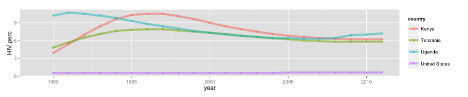

```{r, include=FALSE}
# Don't delete this chunk if you are using the mosaic package
# This loads the mosaic and dplyr packages
require(mosaic)
```

```{r, include=FALSE}
# Some customization.  You can alter or delete as desired (if you know what you are doing).

# This changes the default colors in lattice plots.
trellis.par.set(theme=theme.mosaic())  

# knitr settings to control how R chunks work.
require(knitr)
opts_chunk$set(
  tidy=FALSE,     # display code as typed
  size="small"    # slightly smaller font for code
)
```

```{r, include=FALSE}
# Load additional packages here.  
require(tidyr)
require(readxl)
require(googlesheets)
```

## Obtaining Data from Gapminder

Gapminder makes available a number of data sets at 
[http://www.gapminder.org/data/](http://www.gapminder.org/data/).  
Links there will lead you to publicly viewable google spreadsheets.  
In the example below,
we will use the first one in the list, which provides data for many countries
about the percentage of the population (age 14-49) that had HIV over a number of
years.  We will use this data to make a plot something like this one



You can view this data [here](https://docs.google.com/spreadsheets/d/1kWH_xdJDM4SMfT_Kzpkk-1yuxWChfurZuWYjfmv51EA/pub?gid=0).

If you look at it, you will see that we have some work ahead of us to make this usable (i.e. glyph ready) for our plot.

In theory, we should be able to grab this data directly from the google sheet 
or from the downloaded excel spreadsheet.  
In practice, both of these failed for me.
So I downloaded the excel version and saved the data as a csv file, which I was
able to import.

 * Here's the [csv file](HIV.csv) if you want to skip a couple steps.

OK.  Let's read in the data.
```{r}
HIVdata <- read.csv("HIV.csv", header = TRUE, stringsAsFactors = FALSE) 
```

## Getting the Data Glyph Ready

If we consider a case to to an observation of a country in a given year, then these data are not tidy.  We would like to have a data table with variables
`country`, `year`, and `HIV.perc`  There are several problems that need fixing.

The "name" of the first variable
is really a title for the data set and should be changed to `country`.
We can do this by selecting all of the columns and renaming the ones 
that begin with `"Estimated"`.  (We'll deal with those names that start
with `X` at a different point in the process -- those columns have 
more important issues to fix first.)

```{r}
HIVdata2 <- 
  HIVdata %>% 
  select(country = starts_with("Estimated"), starts_with("X"))
head(HIVdata2, 3)
```

For each row of the form:

```
country      X1979  X1980  X1981  ... X2011
countryname     v2     v3     v4  ...   v34
```
we would like to create multiple rows that look like
```
    country    year  HIV.perc
countryname   X1979        v2
countryname   X1980        v3
countryname   X1981        v4    
    ...        ...        ...
countryname   X2011       v34    
```

That is, we want to **gather** the **values** from multiple columns into a 
single column using the names of those columns as another column (generically called the the **key**).  That is we are turning the column names and column values into key-value pairs.  All the key-value pairs from a given row of the 
wide data will be associated with copies of the variables that were not
part of the key-value pair (in this case, the country gets repeated 33 times).

To do this we 

 * use the `gather()` function from the `tidyr` package
 * specify names for the key and value columns (`year` and `HIV.perc`)
 * specify which columns are being gathered (all the ones that start with `X`, or
 equivalently, all columns except the `country` column).
 
```{r}
HIVdata3 <-
  HIVdata2 %>% gather( year, HIV.perc, -country)
head(HIVdata3, 3)
```

Now we need to remove the `X` from the years.  We can do this with the 
`extract_numeric()` function from `tidyr`:
```{r}
HIVdata4 <-
  HIVdata3 %>% mutate( year = extract_numeric(year))
head(HIVdata4, 3)
```

Now the data are ready for a plot.  Let's compare just a few countries.
There is very little data before 1990, so we'll filter the data to include
just the more recent years.

```{r}
HIVdata4 %>%
  filter(country %in% c("Uganda", "Kenya", "Tanzania", "United States")) %>%
  filter(year > 1988) %>%
  ggplot(aes(x = year, y = HIV.perc, color = country)) +
  geom_line(size=2, alpha=0.5) 
```

## Exercises

 1. Download an additional data file from Gapminder, tidy it, and merge it with the HIV data so that you can make a scatter plot of HIV prevelance vs some other variable that might reveal and interesting pattern?  What will you do about the fact that you have multiple years?  
 
 2. Download still more data files and use them to add additional aesthetics
 to the plot. 

Note: We haven't talked much about dynamic plots, but Hans Rosling's famous 
moving bubble plots are one way to deal with the time variable.
  
 * [Hans Rosling 200 years that changed the world video](https://www.youtube.com/watch?v=BPt8ElTQMIg)
 
 * [A similar thing done entirely in R](https://www.youtube.com/watch?v=FTu4dDHpfdU)
 
 * [A longer video by Hans Rosling](https://www.youtube.com/watch?v=FACK2knC08E)