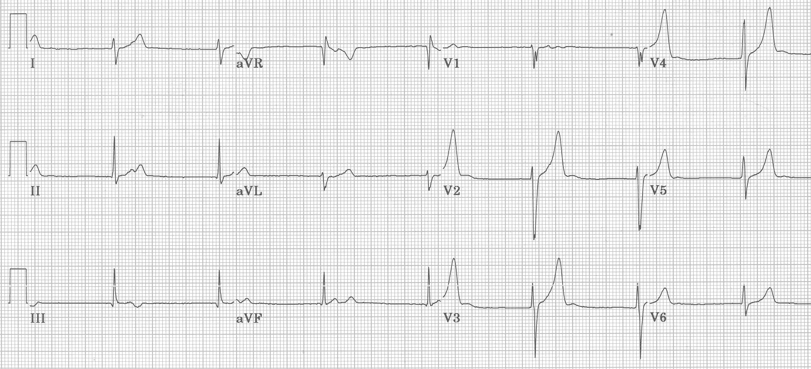
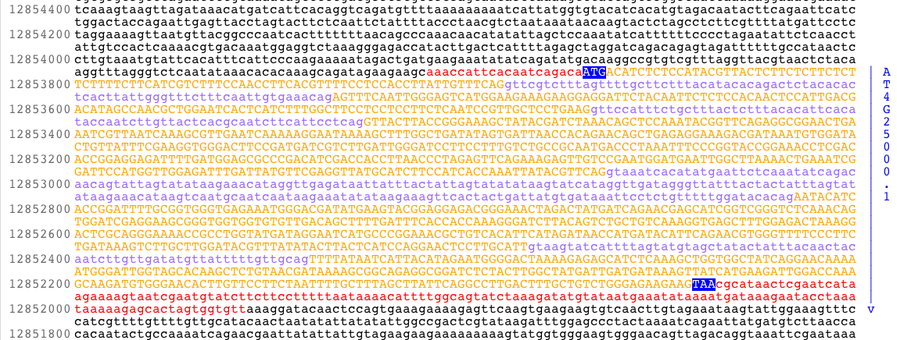
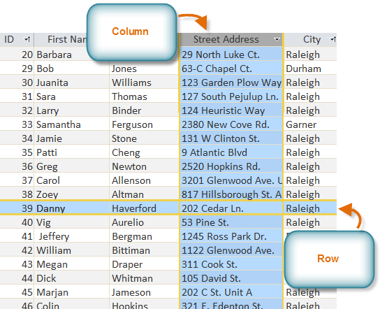

```{r include=FALSE}
require(DataComputing)
require(dplyr)
require(printr)
```


# Data has all sorts of forms

## Signals




<!-- source: http://ecg.utah.edu/img_index -->

## Photographs


<!-- Source: http://aerotechnologies.org/aeroarc-remote-sensing.html -->

## Video

[Follow this link!](https://www.youtube.com/watch?v=MDMRcyJKzdU&feature=youtu.be)

## Text, e.g. What am I doing? on OKCupid

> currently working as an international agent for a freight forwarding company. import, export, domestic you know the works

> online classes and trying to better myself in my free time. perhaps a hours worth of a good book or a video game on a lazy sunday."

> dedicating everyday to being an unbelievable badass.

> i make nerdy software for musicians, artists, and experimenters to indulge in their own weirdness, but i like to spend time away from the computer when working on my artwork (which is typically more concerned with group dynamics and communication, than with visual form, objects, or technology). i also record and deejay dance, noise, pop, and experimental music (most of which electronic or at least studio based). besides these relatively ego driven activities, i've been enjoying things like meditation and tai chi to try and gently flirt with ego death."

> reading things written by old dead people

> work work work work + play

> building awesome stuff. figuring out what's important. having
adventures. looking for treasure. digging up buried treasure

## Sequences



<!-- <a href="https://commons.wikimedia.org/wiki/File:AMY1gene.png#/media/File:AMY1gene.png">AMY1gene</a>" by Original uploader was <a href="//en.wikipedia.org/wiki/User:TransControl" class="extiw" title="en:User:TransControl">TransControl</a> at <a class="external text" href="http://en.wikipedia.org">en.wikipedia</a> - Transferred from <a class="external text" href="http://en.wikipedia.org">en.wikipedia</a>; transfer was stated to be made by <a href="//en.wikipedia.org/wiki/User:Brandon5485" class="extiw" title="en:User:Brandon5485">en:User:Brandon5485</a>.. Licensed under Public Domain via <a href="https://commons.wikimedia.org/wiki/">Wikimedia Commons</a>. -->


## Data Tables

We're going to use just one very simple format: the *data table*.

```{r echo=FALSE}
set.seed(101)
Tmp <- BabyNames %>% sample_n(size = 5) %>% arrange(year)
row.names(Tmp) <- NULL
Tmp
```


## Conversion from images, videos, etc. to data table

### OK Cupid

Sentiment extraction

### Tipi rings in Montana

Assessment on family size based on tipi ring diameter

Population size by adding up the rings

### Animal tracking

# Cases and Variables

## Anatomy of a data table

<div class="columns-2">



<!-- Source: <http://www.gcflearnfree.org/access2010/2.2> -->

* A row is always a **case**
* A column is always a **variable**

</div>

## What's a variable?

<div class="columns-2">


A quantity or category that may vary from case to case.

Two main types:

1. Quantitative: a number
2. Categorical: one of a set of discrete possibilities


### In Tidy Data

* No units
* No footnotes
* Same kind of thing for each case, e.g. don't mix miles and km.

</div>

## Cases

The **object** from which the variables were measured.

Examples: 

* A person, a country, an earthquake, a bike rental
* A person on a date
* A country in a year
* An earthquake and its aftershocks

## Basic Knowledge

1. What is each variable about.
2. What is the kind of object that defines a case

## Tidy Data

Every value for each variable is the same kind of thing as all the other values for that variable.

Every case is the same kind of thing as all the other cases.


## Exercise: 


Go to this spreadsheet ...[Personnel in the US armed forces](https://docs.google.com/spreadsheets/d/1Ow6Cm4z-Z1Yybk3i352msulYCEDOUaOghmo9ALajyHo/edit#gid=1811988794)

### Questions: 

1. What is the case here?
2. How are the data not tidy?
3. What might these data look like in tidy form?
4. Suppose that the case was "an individual in the armed forces."  
    What variables would you use to capture the information in this table?

