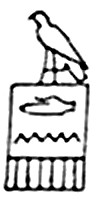
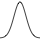
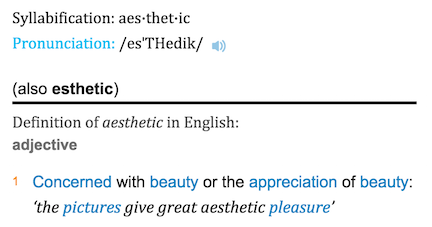
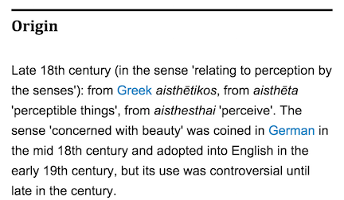

```{r include=FALSE}
require(mosaic)
require(knitr)
knitr::opts_chunk$set(echo = FALSE, message=FALSE)
```

## Glyphs and Data

In its original sense, in archeology, a glyph is a carved symbol.

Heiro**glyph** | Mayan **glyph**
---------------|----------------
 |  

## Data Glyph

### A data glyph is also a mark, e.g. 

               

The features of a data glyph encodes the value of variables. 

* Some are very simple, e.g. a dot: 
* Some combine different elements, e.g. a pointrange: 
* Some are complicated, e.g. a dotplot: 

See: *<http://docs.ggplot2.org/current/>*

## Data Glyph Properties: Aesthetics

Aesthetics are **visual properties** of a glyph.

  * Aesthetics for points: location (x and y), shape, color, size, transparency

```{r echo=FALSE, fig.keep='all', out.width="50%", include=FALSE}
set.seed(102)
n <- 30
Tmp <- data.frame(
  sbp =  round(runif(n, min=80, max=180)),
  dbp = round(runif(n, min=40, max=110)),
  group = sample(c("Tr","Ctl"), size=n, replace=TRUE),
  react = sample( c("Low", "Sev", "Mod"), size=n, replace=TRUE)
)
Tmp <- Tmp %>% mutate(dbp = pmin(sbp, dbp)) 
p <- ggplot(Tmp, aes(x = sbp, y = dbp)) + xlab("Systolic BP") + ylab("Diastolic BP")
p + geom_point(aes(color = group, size=react)) 
p + geom_point(size=5, aes(shape=group, color=react))
```

```{r echo=FALSE, fig.keep='all', out.width="50%"}
set.seed(102)
require(NHANES)
n <- 75
Tmp <- 
  NHANES %>%
  mutate(
    smoker = derivedFactor(
      never = Smoke100 == "No",
      former = SmokeNow == "No",
      current = SmokeNow == "Yes",
      .ordered = TRUE
    ),
    sbp = BPSysAve,
    dbp = BPDiaAve,
    sex = Gender
  ) %>%
  select( sbp, dbp, sex, smoker ) %>%
  sample_n(n) %>%
  filter(complete.cases(.)) %>% 
  data.frame()


p <- ggplot(Tmp, aes(x = sbp, y = dbp)) + 
  xlab("Systolic BP") + ylab("Diastolic BP")
p + geom_point(aes(color = sex, size=smoker), alpha=.8) 
p + geom_point(size=5, aes(shape=sex, color=smoker), alpha=.8)
```

  * Each glyph has its own set of aesthetics.

## Why "Aesthetic"?




## Some Graphics Components

**glyph**
: The basic graphical unit that represents one case.
Other terms used include *mark* and *symbol*. 

**aesthetic**
: a visual property of a glyph such as position, size, shape, color, etc.  

  * may be **mapped** based on data values: `sex -> color` 
  * may be **set** to particular non-data related values: `color is black`

**scale**
: A mapping that translates data values into aesthetics.

  * example:  male -> <font color="blue">blue</font>; female -> <font color="pink">pink</font>

**frame**
: The position scale describing how data are mapped to x and y

**guide**
: An indication for the human viewer of the scale.  This allows the viewer
to translate aesthetics back into data values.

  * Examples:  x- and y-axes, various sorts of legends

## Glyph-Ready Data

Glyph-ready data has this form:

  * There is one row for each glyph to be drawn. 
  * The variables in that row are mapped to aesthetics of the glyph (including position)


<div class="columns-2">
**Glyph-ready data**
```{r echo=FALSE}
head(Tmp,6)
```

**Mapping of data to aesthetics**
```
   sbp -> x      
   dbp -> y     
smoker -> color
   sex -> shape
```

Scales determine details of  
`data -> aesthetic` translation

```{r include=FALSE}
Tmp2 <- Tmp %>%
  rename(x=sbp, y=dbp, color=smoker, shape=sex )
head(Tmp2)
```
</div>

<!--
It's as if the variables were given the name of the aesthetic.
-->


## A few more elements

 1. Facets -- using x and y twice
 2. Layers -- building up to complex graphics
 3. Stats  -- data transformations
 

## Facets -- using x and y twice

```{r}
ggplot(data=Tmp, aes(x = sbp, y=dbp, color=smoker)) +
  geom_point() +
  facet_grid( ~ sex)
```

 * x is determined by `sbp` and `sex`
 * basically a separate frame for each `sex`
 
## Layers -- building up complex plots 

Each layer may have its own data, glyphs, aesthetic mapping, etc.

```{r}
ggplot(data=Tmp, aes(x = sbp, y=dbp, colour = sex)) +
  geom_point() +
  geom_smooth(se = FALSE) 
```

 * one layer has points
 * another layer has the curves

## Stats: Data Transformations

```{r, fig.height=2}
ggplot(data=Tmp, aes(x=sbp)) +
  geom_histogram(binwidth = 10)
```

  * What are the glyphs, aesthetics, etc. for this plot?
  * How is the data for this plot related to the "raw" data?
  
```{r}
head(Tmp,4)
```

## What's Next

 1. **Eye-training** 
 
    * recognize and describe glyphs, aesthetics, scales, etc.
    * identify data required for a plot
    
 2. **Data wrangling** 
 
    * get data into glyph-ready format (`dplyr`, `tidyr`)
    
 3. **Graphics construction** 
 
    * describe data, glyphs, aesthetics, etc. to R (`lattice`, `ggplot2`)

# Exercises

## Start out with a GUI

Map variables to aesthetics with `mplot()`
```{r eval=FALSE}
require(mosaic)
mplot( a_data_frame )
```