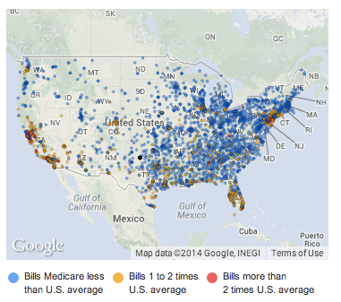

```{r include=FALSE}
require(DataComputing)
require(mosaic)
require(reshape2)
knitr::opts_chunk$set(tidy=FALSE, cache=TRUE)
library(maps)
#load us map data
all_states <- map_data("state")
#plot all states with ggplot
```

## Background

High costs for medical care have been a national concern for more than a decade. There is a wealth of data about medical spending; insurance companies and the government pay most medical costs and keep extensive and detailed records.  Nonetheless, until recently there has been little data available to journalists and other citizens.  The insurance and government data systems are complex and few other organizations have had the resources to study the data. That has changed in the last few years with "open data" programs in government.

In May 2013, the [Centers for Medicare and Medicaid Services](http://www.cms.gov/Research-Statistics-Data-and-Systems/Statistics-Trends-and-Reports/Medicare-Provider-Charge-Data/index.html) (CMS) released data on the price Medicare fee-for-service health services at hospitals around the US in year 2011.  

This attracted press attention.  For example, a headline in the New York Times read ["Hospital Billing Varies Wildly, Government Data Shows"](http://www.nytimes.com/2013/05/08/business/hospital-billing-varies-wildly-us-data-shows.html).  



A [map with the article](http://www.nytimes.com/interactive/2013/05/08/business/how-much-hospitals-charge.html?_r=0) shows the geographic disparities in hospital charges.  

## Studying the Medicare Data

The national news reports emphasize geographic disparities in the billing for procedures. A *citizen-statistician* might be interested to dig deeper into these disparities, perhaps with a local focus.  Or, she might want to investigate what other factors are associated with varying prices, for instance:   

1. The type of procedure.
#. The number of patients receiving the procedure at a given hospital.
#. Age, wealth, and other demographic characteristics of the area.

## Accessing the Data

CMS makes the data available in four formats at this this [download page](http://www.cms.gov/Research-Statistics-Data-and-Systems/Statistics-Trends-and-Reports/Medicare-Provider-Charge-Data/Inpatient2013.html) with similar pages for years 2011 and 2012.  The four formats are

1. [Inpatient charge data, FY 2013, Microsoft Excel](http://www.cms.gov/Research-Statistics-Data-and-Systems/Statistics-Trends-and-Reports/Medicare-Provider-Charge-Data/Downloads/Inpatient_Data_2013_XLSX.zip)
2. [Inpatient charge data, FY 2013, Comma Separated Values](http://www.cms.gov/Research-Statistics-Data-and-Systems/Statistics-Trends-and-Reports/Medicare-Provider-Charge-Data/Downloads/Inpatient_Data_2013_CSV.zip)
3. [National and State Summaries, Microsoft Excel](http://www.cms.gov/Research-Statistics-Data-and-Systems/Statistics-Trends-and-Reports/Medicare-Provider-Charge-Data/Downloads/Inpatient_Summary_2013_XLSX.zip)
4. [National and State Summaries, Comma Separated Values](http://www.cms.gov/Research-Statistics-Data-and-Systems/Statistics-Trends-and-Reports/Medicare-Provider-Charge-Data/Downloads/Inpatient_Summary_2013_CSV.zip)

As you can see, there are two kinds of data: "charge data" and "national and state summaries."  There are also two kinds of data table file formats: Excel and CSV.  Usually, as here, the two file formats contain the same data; you only need to use one of them. It's generally easier to use the CSV format.

A codebook in PDF format is provided under a link labelled *[methodology](http://www.cms.gov/Research-Statistics-Data-and-Systems/Statistics-Trends-and-Reports/Medicare-Provider-Charge-Data/Downloads/Inpatient_Methodology.pdf)*. This CMS documentation doesn't specify in a concise way what a *case* means.  After you load the data into R, you can figure this out.

For convenience the 2011 inpatient data are available in the `DataComputing` package in the form of three data tables: `MedicareCharges`, `MedicareProviders`, and `DirectRecoveryGroups`. This case study will work with those tables.

#### Checking the Data

The New York *Times* says:

> The data for 3,300 hospitals, released by the federal Centers for Medicare and Medicaid Services, shows wide variations not only regionally but among hospitals in the same area or city.

A quick summary of the data using commands that students might encounter in an introductory statistics course:
```{r}
nrow(MedicareCharges)
nrow(MedicareProviders)
```

The second number corresponds well with the New York *Times* description. But why are there `r nrow(MedicareCharges)` rows if there are only `r nrow(MedicareProviders)` hospitals?  Because there is a separate listing for each of 100 procedures (known as a Direct Recovery Group (DRG)).

```{r}
nrow(DirectRecoveryGroups)
```

If every provider had a listing for every DRG, there would be `r nrow(MedicareProviders)` times `r nrow(DirectRecoveryGroups)` cases in `MedicareCharges`. There's only about half that many; a typical provider is listed roughly 50 times.


## Loading the data directly from the source

It can be instructive to follow the process of loading the data directly from the Centers for Medicare and Medicaid Studies into R. Again, you don't need to do this unless you want to experience the process or apply the pattern to a new source of data, for instance the 2013 or other more recent data.

Using a browser, download the file at the link to the "inpatient data" in CSV format.  As you'll see, the result is a file named `Inpatient_Data_2013_CSV.zip`.  This is not actually a `.csv` file; it is a `.zip` compressed file.  A `.zip` file is analogous to a suitcase: it can hold several different items in a compressed format suitable for easy transport.^[If "suitcase" is too informal for you, an alternative word is "portmanteau."] You "unzip" such a file to gain access to the uncompressed contents. 

The `Inpatient_Data_2013_CSV.zip` contains just one item.  Opening the suitcase (that is, "unzipping" it) extracts that item: `Medicare_Provider_Charge_Inpatient_DRG100_FY2013.csv`.^[It would have been nicer if the single item in the suitcase had a name related to the suitcase itself, e.g. `Inpatient_Data_2013.csv`.  Then you would know exactly what to expect.]

Similarly, you can uncompress the "summary" zip file.  This will reveal two files:

1. `Medicare_Charge_Inpatient_DRG100_DRG_Summary_by_DRG_FY2013.csv`  
2. `Medicare_Charge_Inpatient_DRG100_DRG_Summary_by_DRGState_FY2013.csv`

It turns out that you won't need the summary files, but look at them anyways.

It's informative to look at the size of the `.csv` files.  This helps you to evaluate whether or not you will have problems handling the files.

* Inpatient CSV file: 26.9 MB
* DRG summary file: 0.009 MB (that is, 9 KB)
* DRG/State summary file: 0.462 MB (that is, 462 KB)

A file of 26.9 MB is easily handled by today's personal computers.  Note that the summary files are much smaller.  That makes sense for a summary! The DRG/State summary file is about 50 times larger than the DRG summary file. Why do you think?  What is it about states in the US that suggests a number like 50?

You can load the `.csv` data into R with commands like these:
```{r eval=FALSE}
Inpatients <- readr::read_csv(file.choose())
# Navigate to the CSV file
# And similarly for the two summary files
DRGState <- readr::fread(file.choose())
DRG <- readr::fread(file.choose())
```

Once you have read in these three data tables, look at their sizes in the *Environment* tab in RStudio.  It's common for the table stored in R to be much smaller than the CSV file it was created from, in this case 13.2 MB versus 26.9 MB for the inpatient data.

### EXERCISE: Pack your suitcase neatly

Download the `.zip` files for both year 2011 and 2013.  The contents of the files are arranged differently in the two years. (This is *not* good!) Explain how the contents (that is, the files, their names, and their location) are different.

## Sanity Checks

It's useful to compare the data to your expectations for what values should be.  This can help reveal your misconceptions about what the data are.  So ask some easy questions for which you already have an approximate answer.

## How many procedures?

There are about 300 million people in the US.  It's reasonable to expect that millions of inpatient procedures are performed, only a fraction of which are covered by Medicare or Medicaid.  The `totalDischarges` variable gives the number of people in each DRG for each hospital.  Add these up to get the total number of procedures listed in the data.

R provides several different "dialects" for such calculations. In "base R" you might write
```{r}
with(data = MedicareCharges, sum(totalDischarges))
```
With the `mosaic` package you can write this more concisely (and do more complex calculations such as breaking down the total by some other variable):
```{r}
library(mosaic)
sum( ~ totalDischarges, data = MedicareCharges)
```

These notes, as in the *Data Computing* Book, use the dialect provided by the `dplyr` package.  For very simple tasks such as this, `dplyr` will seem more verbose, but `dplyr` also provides more power for complicated calculations.
```{r}
MedicareCharges %>%
  summarize(total = sum(totalDischarges))
```

Of course, all three dialects provide the same answer: about 7 million in-patient procedures are contained in the `MedicareCharges` data.


## How much is Spent?

How much did Medicare pay out for these services?  We expect that it will be many billions of dollars.

```{r}
MedicareCharges %>%
  summarise(paid = sum(totalDischarges * avePayments),
            charged = sum(totalDischarges * aveCharges))
```

$246 billion was charged.  "Only" $67 billion was paid

## How much do payments and charges vary by state?


```{r}
MedicareSpending %>% group_by(Provider.State) %>%
  summarize( 
    TotalPaid = mean( Average.Total.Payments, na.rm=TRUE ),
    TotalCharged = mean( Average.Covered.Charges, na.rm=TRUE )
    )  -> StateCharges

tmp <- transform( StateCharges, State=reorder( Provider.State, TotalPaid ))
ggplot( melt(tmp,variable.name="Amount"), aes(x=State, y=value/1000, color=Amount)) +
  geom_point( ) + scale_y_log10(breaks=c(1,5,10,15,20,30,40)) + 
  xlab("State") + ylab("1000 USD per procedure")
```

Maybe better to show the variation within states:
```{r}
tmp <- select(MedicareSpending, State=Provider.State, 
              Charged=Average.Covered.Charges,
              Paid=Average.Total.Payments)
tmp %>% transform(State=reorder(State, Paid, FUN=median)) -> tmp
tmp2 <- melt(tmp,variable.name="Amount")
ggplot( tmp2, aes(x = State, group = State, y = value/1000)) +
  geom_boxplot( ) + scale_y_log10(breaks = c(1,5,10,15,20,30,40,80,160,320)) + 
  xlab("State") + ylab("1000 USD per procedure") + facet_grid( ~Amount )
```

Now by DRG:

```{r}
# Transform the codes to just their numbers.
DRGnums <- substr(as.character(levels(MedicareSpending$DRG.Definition)),0,3)
MedicareSpending$DRG <- factor(MedicareSpending$DRG.Definition, labels=DRGnums)
```

## Range of Costs by DRG

```{r}
MedicareSpending %>% select( State=Provider.State,
              Charged=Average.Covered.Charges,
              Paid=Average.Total.Payments,
              DRG) -> tmp 
tmp %>%  mutate(DRG=reorder(DRG, Paid, FUN=median)) %>%
  sample_n(size=100000) -> tmp
tmp2 <- melt(tmp,variable.name="Amount")
ggplot( tmp2, aes(x = DRG, y = value/1000)) +
  geom_boxplot( ) + scale_y_log10(breaks = c(1,5,10,15,20,30,40,60,80,100,150,200,300,500)) + 
  xlab("DRG") + ylab("1000 USD per procedure") + facet_grid( ~Amount )
```

## Comparing the 3 highest and 3 lowest cost states and some other big ones

```{r}
nstates <- 3
tmp <- arrange(StateCharges,TotalPaid)
extremes <- rbind(head(tmp,nstates),tail(tmp,nstates))$Provider.State
extremes <- c(as.character(extremes),'NY','CA','TX','MN')
MedicareSpending %>% 
  select( State=Provider.State,
              # Charged=Average.Covered.Charges,
              Paid=Average.Total.Payments,
              DRG) %>%
  mutate(DRG=reorder(DRG, Paid, FUN=median)) %>%
  filter( State %in% extremes) -> ExtremeStates
ggplot( ExtremeStates, aes(x = DRG, y = Paid/1000)) +
  geom_boxplot( ) + scale_y_log10(breaks = c(1,5,10,15,20,30,40,60,80,100,150,200,300,500)) + 
  xlab("DRG") + ylab("1000 USD per procedure") + facet_wrap( ~ State, nrow=3 )
```

The DRGs vary in the same way within a state.  Let's pick one DRG to investigate.  Perhaps the one that appears in the most states.

```{r}
MedicareSpending %>% select( State=Provider.State,
              Charged=Average.Covered.Charges,
              Paid=Average.Total.Payments,
              DRG, ZIP=Provider.Zip.Code) -> SmallMed
SmallMed %>% group_by(DRG) %>% 
  summarize( med = median(Paid), nStates=length(unique(State)), 
             nZips=length(unique(ZIP))) %>%
  arrange(med) %>% 
  filter( rank(med) %in% c(45:55))
```

Let's take DRG 872: **SEPTICEMIA OR SEVERE SEPSIS W/O MV 96+ HOURS W/O MCC**

```{r}
SmallMed %>% filter( DRG=='872') -> DRG872
```

## Bring in the ZIPs

This service is provided in `r nrow(DRG872)` ZIP codes.  Almost all of those ZIP codes have only one provider:

```{r}
table(table(DRG872$ZIP))
```

How much does the cost differ by state?

```{r}
DRG872 %>% group_by(State) %>% mutate(med=median(Paid)) -> tmp
DRG872$State <- reorder(DRG872$State, tmp$med)
ggplot(DRG872, aes(x=State, y=Paid)) + 
  geom_boxplot(color='red',fill=NA, aes(y=Charged)) + 
  geom_boxplot(fill=NA) + scale_y_log10(breaks=c(1000,2000,4000,8000,15000,30000,60000,120000,240000))
```

Let's pick some ZIP code variables:
```{r}
data(ZipDemography)
data(ZipGeography)
ZD <- select(ZipDemography, ZIP, Pop=Totalpopulation,
             Over65=X65yearsandover,
             College=Bachelorsdegreeorhigher,
             Disabled=Disabilitystatuspopulation21to64years,
             Income=Medianhouseholdincomedollars)
ZG <- select(ZipGeography, ZIP, Latitude, Longitude, LandArea)
Zips <- inner_join(ZD, ZG) %>% mutate(ZIP = as.character(ZIP))

DRG872 <- mutate(DRG872, ZIP=as.character(ZIP)) %>% inner_join( Zips)
```


## Looking at Charged versus demography

```{r, dev='png'}
ggplot( DRG872, aes(x=Over65/Pop, y=Charged)) +
  geom_point() + scale_y_log10() 
ggplot( DRG872, aes(x=Income, y=Charged)) +
  geom_point() + scale_y_log10() 
ggplot( DRG872, aes(x=LandArea, y=Charged)) +
  geom_point() + scale_y_log10() + scale_x_log10()
ggplot( DRG872, aes(x=Pop/LandArea, y=Charged)) +
  geom_point() + scale_y_log10() + scale_x_log10()
```

```{r}
DRG872 <- transform(DRG872, Rgroup=ntiles(Charged,4))
ggplot(DRG872, aes(x=Longitude,y=Latitude,color=Rgroup)) + 
  geom_point() + facet_wrap(~ Rgroup,nrow=2) + geom_polygon( data=all_states, aes(x=long, y=lat, group = group),colour="white", fill=NA )
```

## Doing things for all the DRGs

Fit `log(Charge)` to `DRG` and take the residual.

```{r}
mod <- lm(log10(Charged) ~ DRG, data = SmallMed)
SmallMed$Resid <- resid(mod)
SmallMed <- mutate(SmallMed, ZIP=as.character(ZIP)) %>% inner_join( Zips)
```

```{r dev='png'}
SmallMed$State <- reorder(SmallMed$State, SmallMed$Resid)
ggplot( SmallMed, aes(x=State, y=Resid)) + geom_boxplot()
ggplot( SmallMed, aes(x=Pop/LandArea, y=Resid)) +
  geom_point(alpha=.02) + scale_x_log10()
```

```{r}

SmallMed <- transform(SmallMed, Rgroup=ntiles(Resid,9))
ggplot(SmallMed, aes(x=Longitude,y=Latitude,color=Rgroup)) + 
  geom_point() + facet_wrap(~ Rgroup,nrow=3) + geom_polygon( data=all_states, aes(x=long, y=lat, group = group),colour="white", fill=NA )
```


## Models?

```{r}
mod2 <- lm(Resid ~ 
             I(Pop/LandArea) + Income + I(College/Pop), data=SmallMed )
rsquared(mod2)
anova(mod2)
mod3 <- lm(Resid ~ I(Pop/LandArea) + Income + I(College/Pop) + State + Latitude, data=SmallMed )
rsquared(mod3)
anova(mod3)
```

Can we capture the effect of `State` with demographic variables?


## Normalizing the Data

