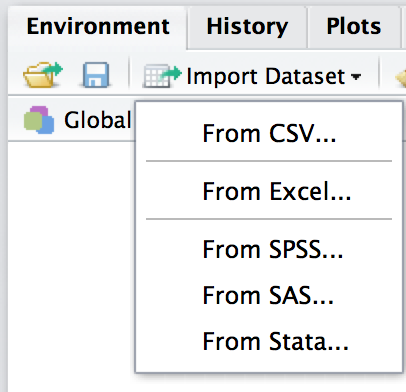
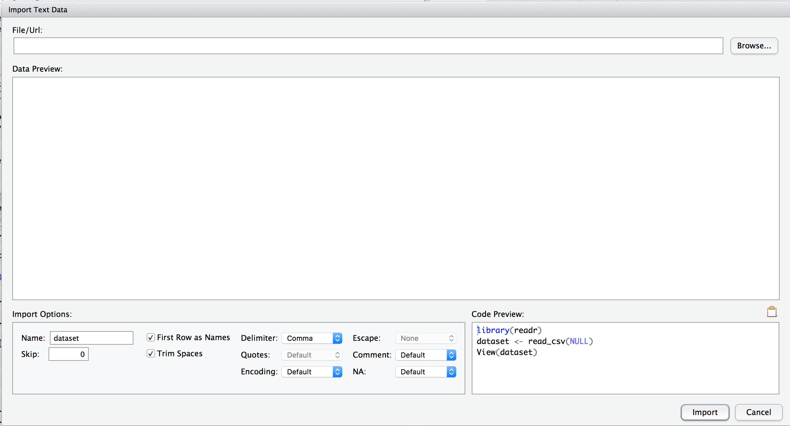

```{r setup, include=FALSE}
knitr::opts_chunk$set(
  eval = TRUE, 
  include = TRUE, 
  echo = TRUE,
  cache = FALSE,
  size = "small")
require(tidyr)
require(readxl)
require(mosaic)
trellis.par.set(theme = col.mosaic())
options(width = 90, digits = 3)
```


Working with data in packages is great for learning how R works, but 
eventually you will want to use your own data, or data that you obtain 
from somewhere else.  These notes discuss ways to get data into R.

# Some sources for data

Here are some places that have data sets available online

  * [data.gov](https://catalog.data.gov/dataset?res_format=CSV) has more than 
  10,000 data sets in csv format (plus others in other formats)
  
  * [publicdata.eu](https://publicdata.eu/dataset) has more than 
  10,000 data sets in csv format (plus others in other formats)
  
  * [World Bank](http://data.worldbank.org/) has data in several
  formats, including csv an Excel
  
  * [datahub](http://datahub.io/dataset?res_format=CSV) has over 
  1,000 data sets in csv format (plus others in other formats)
  
  * [CSV format data from several R packages](https://vincentarelbundock.github.io/Rdatasets/datasets.html) 
    * It is easier to get this data from within the package, but 
    they can be used as examples for import from CSV format.
    The resulting data is typically all tidied and ready to be 
    used for analysis.
  
## Importing CSV and Excel Data

Data can be stored in many file formats.  The CSV (comma separated values)
and TSV (tab separated values) file formats are among the most commonly used,
and most data handling software can export to CSV and import from CSV, so it 
good to learn how to work with CSV data.

Excel can also export to CSV, but it is safer to import Excel data directly, since 
the export to CSV and reimport.  Reading directly from Excel has several advantages:

  * It avoids having multiple copies of the data, which could become out 
  of sync and cause confusion.
  * It makes it easy to automate work with Excel spreadsheets.
  * It allows you to work with Excel spreasheets even if you don't have 
  Excel running (or even installed) on your machine.
  * If we use the `readxl` package for this, then certain oddities of 
  Excel files are taken care of for us.
  Most importantly, `readxl` takes care of 
  date conversion an knows how to handle data from multiple versions of 
  Excel.  (This can be a source of major problems if you use Excel-generated
  CSV files.)

**Exercise:** Obtain a csv file or Excel spreadsheet containing data.
You can create or use your own data or find a data set online.

### Uploading Files to RStudio Server

**This step is only required in the web version of RStudio** when the 
file you want to import is on your **local machine** and not on the server.
This will save a copy of the file on your local machine on the server.

 1. In the Files tab, navigate to the folder where you want to store the file.
 
 2. Choose "Upload File"
 
 3. Navigate to the file on your local machine.
 
That's all there is to it.  You can use this procedure to upload files of any type.

### Importing Data into your R Session

  1. In the Environment Tab find "Import Dataset".
 
  2. Choose the appropriate file type
 
  
 
    Note: The files must live on the same machine as RStudio.  If you
    are using the web version of RStudio, you may need to upload your file
    first.  See the previous section.
 
  3. In the form below, fill out the information for your data set
  
    a. Navigate to the file, or paste in the URL.
 
    b. Name the data set (the default name is derived from the file name).
 
    c. Fill out the form to declare the structure of the file.
 
    d. Hit "Import" to import the data.
 
    
  

This will place the data set in your working environment.

### Using R commands directly

If you import data using the interface described above, you will see that RStudio
executes some commands in the console.
Using RStudio's ability to import data is handy for interactive use,
but it is not part of a reproducible workflow an can't be use in
RMarkdown documents. You can simply copy and paste the commands from the console 
(skip the `View()` command if you are copying into an RMarkdown document since 
`View()` is not available there.)

Since CSV files are very common and there are multiple ways to import CSV
files, it is good to know a bit more about CSV imports.
The main functions we can use for this are `read.csv()` 
and `readr::read_csv()` and `mosaic::read.file()`.
These functions work similarly.

For our example, we will use the `Anscombe.csv` file which you can obtain using the command below.

```{r, eval=FALSE}
download.file(
  "http://vincentarelbundock.github.io/Rdatasets/csv/car/Anscombe.csv",
  "Anscombe.csv")
```

Now let's import the data using each of these three functions.
```{r}
Anscombe1 <- read.csv("Anscombe.csv", header=TRUE)
require(readr)
Anscombe2 <- read_csv("Anscombe.csv")
require(mosaic)
Anscombe3 <- read.file("Anscombe.csv")
```

The following shows a few of the differences among these functions.

```{r}
inspect(Anscombe1)
inspect(Anscombe2)
inspect(Anscombe3)
```

  * `read.csv()` needs to be told that there is a header row containing
  the variable names.  The others need to be told when there is *not* a header row.
  
  * `read.csv()` modifies variable names to make them "nice";
  `read_csv()` does not.
  Notice that in `Anscombe2` has no name for the first variable, 
  while `Anscombe1` renames this as `X`.  We can rename this manually
  if we like:
  
```{r}
names(Anscombe2)[1] <- "state"  # rename first variable
xyplot( education ~ income, data = Anscombe2)
```

  * `read.csv()` converts character data into factor data (by default);
    `read_csv()` does not.

  * `read.file()` uses the file name to guess which of several functions to use 
  for file import.  In this case it is using `read.csv()`.  It can also read 
  several other types of files.  See `?read.file` for details.
  
  * depending on the file structure, `read_csv()` or `read.csv()` may fail when 
  the other succeeds.  It's good to know about both if you are using data from
  online sources.
  

## Importing Excel Spreadsheets

In the same way, we can use R commands to import from an Excel spreadsheet (for example,
by copying and pasting from the console after using the GUI).  Here's what that 
would look like.

  
```{r, eval=FALSE}
download.file(
  "http://api.worldbank.org/v2/en/topic/17?downloadformat=excel",
  "Gender.xls")
```

The first two rows of this spreadsheet don't contain data, so we'll skip
them.

```{r}
require(readxl) 
Gender <- read_excel("Gender.xls", skip=2)
inspect(Gender[, 1:10])
```

We would like to reformat this data so that year is one of the variables
instead of having a column for each year.  We can do this with
the `tidyr` package; we just need to inicate which columns should be
converte to data and give a name for the variable (`key`) and its 
values (`value`).  The remaining variables are duplicated as needed.

```{r}
require(tidyr)
Gender2 <- 
  Gender %>% 
  gather(
    "year", "value",
    `1960`:`2014`
  ) %>% 
  filter(!is.na(value)) %>%
  mutate(year = extract_numeric(year))
inspect(Gender2)
head(Gender2)
```

Now we can pick one of the inicators and some countries and compare
them over time.

```{r}
Gender2 %>% 
  filter(`Country Code` %in% c("USA", "NLD", "SWE", "KOR", "JPN"),
         `Indicator Code` %in% c("SP.ADO.TFRT")) %>%
  xyplot(value ~ year, data = ., groups = `Country Code`, type = "l",
         auto.key=list(lines=TRUE, points=FALSE, columns=5), 
         ylab = Gender2$`Indicator Name`[1])

Gender2 %>% 
  filter(`Country Code` %in% c("USA", "NLD", "SWE", "KOR", "JPN"),
         `Indicator Code` %in% c("SP.ADO.TFRT")) %>%
  ggplot() +
  geom_line(aes(y=value, x=year, colour=`Country Code`)) +
  labs(y = Gender2$`Indicator Name`[1])
```
  
  **Exercise:** Import an Excel spreadsheet into R an create a plot.

## Importing from Google Spreadsheets

The `googlesheets` package makes it easy to read data from (and write data to) google spreadsheets.  You can find a vignette describing how to use the package here:

 * [http://htmlpreview.github.io/?https://raw.githubusercontent.com/jennybc/googlesheets/master/vignettes/basic-usage.html](http://htmlpreview.github.io/?https://raw.githubusercontent.com/jennybc/googlesheets/master/vignettes/basic-usage.html)

## Other Data Formats

Many packages provide the ability to read specialized forms of data 
(e.g. genetic sequence data) or data saved in formats native to other software 
(SAS, SPSS, etc.).  The `foreign` package, for example, has functions to 
import data from Minitab, S, SAS, Stat, Systat, Weka, octave, and more.

For data specialized for particular purposes,
you might check a relevant
[CRAN Task View](http://cran.r-project.org/web/views/).

For things related
to biological applications, [Bioconductor](http://www.bioconductor.org/) is another place to look.  In particular, take a look at the 
[Bioconductor Workflows](ww.bioconductor.org/help/workflows/).
