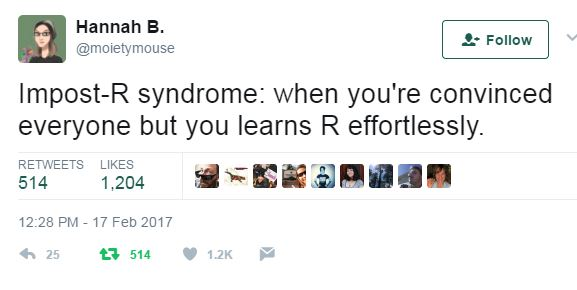

```{r setup, include = FALSE}
library(learnr)
knitr::opts_chunk$set(echo = FALSE)
knitr::opts_chunk$set(
  echo = TRUE, tidy = FALSE, size = "small",
  fig.width = 8, fig.height = 6)

require(mosaic)
require(ggformula)

require(babynames)      # gets us baby names data set
smallbaby <-
  babynames %>%
  filter(year > 2000) %>%
  sample_n(size = 200)
nicknames <- babynames %>% filter(name == "Nicholas")
MaryAndJane <-
  babynames %>%
  filter(sex == "F") %>%
  group_by(year) %>%
  mutate(total = sum(n)) %>%
  filter(name %in% c("Mary", "Jane")) %>%
  mutate(proportion = n / total)
```


## Getting Organized

Here we go.

### In order to analyze your data you need to organize your data correctly

- Keeping your data **clean** and **tidy** is an important step of every data project

- Goal: learn how to take the data set you **have** and tidy it up to be the data set you **want** for your analyses


### Tidy Data 

- rows (cases/observational units) and 
- columns (variables).  

- The key is that *every* row is a case and *every* column is a variable.  

- No exceptions.


## Chaining 

The pipe syntax (`%>%`) takes a data frame (or data table) and sends it to the argument of a function.  


- `x %>% f(y)` is the same as `f(x, y)`

- `y %>% f(x, ., z)` is the same as `f(x,y,z)`


## Building Tidy Data 

```{r, eval = FALSE}
object_name <- function_name(arguments) 
object_name <- data_table %>% function_name(arguments) 

object_name <-   
  data_table %>%  
  function_name(arguments) %>%  
  function_name(arguments)
```

- in chaining, the value (on left) %>% is **first argument** to the function (on right)


## 5 Main Data Verbs

Data verbs take data tables as input and give data tables as output

1. `summarise()`: computes summary statistics

### Rows 

2. `filter()`:  subsets unwanted *cases* 
3. `arrange()`: reorders the *cases* 

### Columns

4. `select()`: subsets *variables* (and `rename()` )
5. `mutate()`: transforms the *variable* (and `transmute()` like mutate, returns only new variables)

### Other Data Verbs

- `distinct()`: returns each unique row once
- `sample_n()`: take random row(s)
- `head()`:  grab the first few rows
- `tail()`: grab the last few rows
- `group_by()`: SUCCESSIVE functions are applied to groups
- `ungroup()`:  reverse the grouping action
- `summarise()`:  
    + `min()`, `max()`, `mean()`, `sum()`, `sd()`, `median()`, and `IQR()`
    + `n()`: number of observations in the current group
    + `n_distinct()`: number of unique values of a variable
    + `first_value()`, `last_value()`, and `nth_value(x, n)`: (like `x[1]`, `x[length(x)]`, and `x[n]` )


## Baby Names

### babynames Data

```{r}
babynames %>% head()
```

### Small data set

Again let's work with a small subset of the data.

```{r}
smallbaby <-
  babynames %>%
  filter(year > 2000) %>%
  sample_n(size = 200)

names(smallbaby)
```

### How many babies?

#### Exercise

Determine how many babies are represented in the data.  Once you have things working
for the small data set, switch to the full `babynames` data.

```{r small-how-many, exercise = TRUE}
smallbaby %>%
  summarise(total = ????(n)) # a reduction verb
```


<div id="small-how-many-hint">
Use `sum()`.
</div>

### How many babies in each year?

#### Exercise

  1. Edit the code below to create a table that lists the total number of babies in each year.  
  2. Once you have this working for `smallbaby`
    a. Switch to `babynames` 
    b. Use a plot rather than a table (since there will be a lot more data to look at)

```{r small-baby-total, exercise = TRUE}
smallbaby %>% 
  group_by(????) %>% 
  summarise(total = ????(n))
```

### Actually, not all babies are included

The `babynames` data only includes a name for a given year and sex if there were at least five such 
babies who received that name.  

#### Exercise

Determine how many kids of each sex are not included each year. 
We can get this by adding the proportions to see how far short of 1 the sum is.

```{r, shortfall, exercise = TRUE}
babynames %>%
  group_by(sex, year) %>%
  summarise(
    total_in_data = ???,
    total_proportion = ???,
    shortfall = ???
  ) %>%
  gf_line(shortfall ~ year, color = ~sex)
    
```


## Selecting only certain names

### Reminder filter():  subsets *cases* (rows)

Let's create a data set containing only babies named Nicholas.

#### Exercise

Run this code and then fix the terrible plot it produces.

```{r , nicknames, exercise = TRUE, hint = "Use gf_point() and see if that helps clarify the problem"}
nicknames <- babynames %>% filter(name == "Nicholas")
gf_line(prop ~ year, data = nicknames)
```


### Girls named Nicholas?

Let's create a data set that has only the boys named Nicholas.

```{r, nicknames-male, exercise = TRUE}
nicknames_male <- babynames %>% filter(name == "Nicholas", sex == "M")
gf_line(prop ~ year, data = nicknames_male)
```

## Mary Jane

#### Exercise

Track the yearly number of Janes and Marys over the years.

```{r eval = FALSE}
MaryJane <-
  babynames %>%
  ????(name %in% c("Jane", "Mary")) %>%    # just the Janes and Marys
  group_by(????, ????) %>%  # for each year for each name
  summarise(count = ????)   # count of the kids
```


#### Exercise

Track the yearly number of Janes and Marys over the years. 

  1. Create a data set containing only female Marys and Janes.
  2. Plot the number of girls with these names over time.
  
```{r, mary-jane, exercise = TRUE}
MaryJane <-
  babynames %>%
  filter(sex == "F", name %in% c("Jane", "Mary"))     # just the female Janes and Marys
gf_line( ??? ) 
```


## Missing Babies

As it turns out, not all children are included in the `babynames` data.  A name only shows up for a given year and sex combination
if at least 5 children of that sex received that name in that year.  (Got all that?)  The proportions are proportions of **all**
births.  Combining the counts of the names in the data and the proportion short fall, we can determine how many children are not
represented in the data.

#### Exercise

Determine the number of missing children by comparing the sum of proportions and the sum of the counts.

```{r, shortfall2, exercise = TRUE}
Baby <-
  babynames %>%
  group_by() %>%
  mutate(kids_in_data = ,
         total_proportion = ,
         total_kids = ,
         shortfall = total_kids - kids_in_data
         ) 
gf_line(shortfall ~ year, data = Baby, color = ~sex)
```

```{r, include = FALSE, eval = FALSE}
Baby <-
  babynames %>%
  group_by(year, sex) %>%
  mutate(kids_in_data = sum(n),
         total_prop= sum(prop),
         total_kids = kids_in_data / total_prop,
         shortfall = total_kids - kids_in_data
         ) 
gf_line(shortfall ~ year, data = Baby, color = ~sex)
```


## Mary and Jane

#### Exercise

 1. Create a data set that includes only girls named Mary or Jane.
 2. Use your data to create a plot showing the proportions of these two names over time.


```{r eval = FALSE}
MaryJane <-
  babynames %>%
  # wrangle here
gf_line( ??? )
```


```{r , fig.center = TRUE}
gf_line(proportion ~ year, color = ~name, data = MaryAndJane)
```

## Your Name Here

### Exercise

 1. Pick out a name of interest to you (perhaps your own name).
 2. Plot out their popularity over time.

```{r , pick-a-name, exercise = TRUE}
OneName <- babynames %>%
  filter()  # wrangle here
  
gf_line(n ~ year, data = OneName, col = ~ sex, size = 1, data = OneName)
```


### Exercises

 1. Determine whether the name Pat was ever more common for males than for females.
 2. Take a look at the popularity of the name Hilary (for boys and girls) over time
 3. Pick some other names of interest and do the same.
 4. Try multiple names at the same time (use `%in%`)

```{r , pat, exercise = TRUE}
OneName <- babynames %>%
  ## wrangle here
  
gf_line(n ~ year, data = Pat, col = ~sex, size = 1, data = Pat)
```


## You are on your way to wrangling and transforming your data with ease

### Keep practicing, keep learning

<div align="center">

</div>

