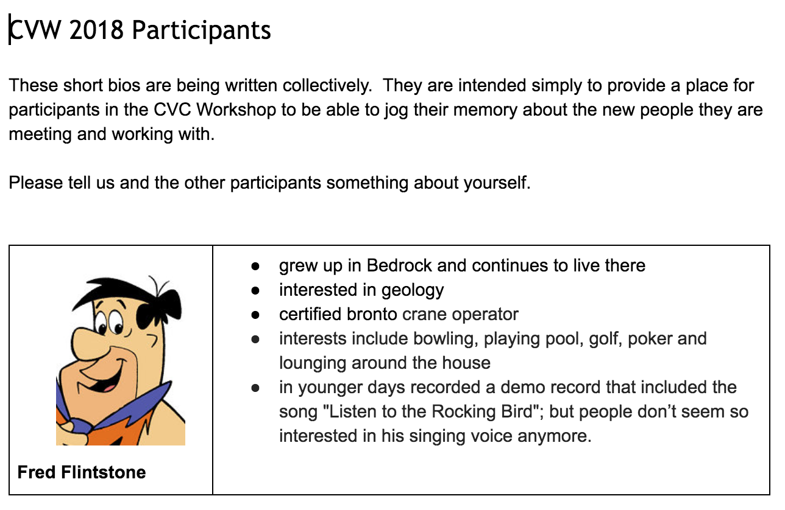

# Welcome

## Welcome to CVW 2018

Two important questions before we begin

## Welcome to CVW 2018

Two important questions before we begin

<iframe width="560" height="315"
src="http://www.youtube.com/embed/uKpX-5jQjQ0"
frameborder="0" allowfullscreen>
</iframe>

  
[video link](http://www.youtube.com/watch?v=uKpX-5jQjQ0)

## Who are you?

* We'll be doing some introductions shortly.

## Why are you here?

* You might have some clear ideas/goals -- we want to hear them

* You might not know -- you are welcome, too

* Your reasons might change as the workshop goes along

## Outline of the workshop

1. Shop
2. Work

More details at [cvc.mosaic-web.org/Summer2018/schedule2018.html](../schedule2018.html)

 * **Please bookmark this page.**  We will post links to materials on this page so you can access them.

## Outline of the workshop -- Part 1

**Shop**

We will present you with some tools for 
learning from data and give you an opportunity to give them a test drive

  * introduction to R and RStudio
  * data visualization
  * data manipulation (tidying, cleaning, summarizing, etc.)
  * reproducible workflow with RMarkdown
    
You get to "try things on" and "see how they fit"

## Outline of the workshop -- Part 2

**Work**

You will have a chance to prepare something of your own choosing to use

  * in a class
  * in a lab
  * in your research
  * ???
    
We will work with you to find and learn what you need

  * Collaboration is encouraged.
  * Break out sessions will be schedules as needed (boutique shopping).
  * You can choose the mix of working and shopping that is right for you.

## How do we define success? {.build}
    
 1. You leave here having learned something of value to you.

 2. You leave here equipped to continue learning after the workshop is over.

 3. You get to know some interesting people (and what they are interested in).

 4. You have an enjoyable time.

## A note about the "schedule"

Our schedule does not include any times.

  * Breakfast at **8 am**
  * Start at **9 am** end around **4 pm** with breaks/lunch as needed.
  * You are welcome to extend beyond **4 pm** if you like.

We can take the time we need before moving on

  * Be sure to ask questions and provide us [feedback](https://docs.google.com/document/d/1t3jlDOpXnv1YI-GiekWPiRXR5CsHlNn5B851W5fSgBY/edit?usp=sharing) so we can adjust appropriately.

## A note about R

R is one tool for working with data, but many of the things
we will talk about are more general than R and apply equally 
to other ways of working with data.

R's particular advantages:

  * state of the art (high quality, wide scope)
    * widely used in academia and industry
  * excellent data visualization 
  * reproducible workflow tools
  * free!

# Introductions

## Introductions

 1. Get into a group of 3 or 4 people **whom you don't already know**.
 
 2. Introduce yourselves.
 
    * be sure to mention something about what sort of project you might be interested in
    
 3. As you introduce yourself, *someone else* in the group should add an entry to
 this [google doc](https://docs.google.com/document/d/17JBw6KW-i5hJffL96kiRTxTjlJFW2qGBrl1g9Ixgb4I/edit?usp=sharing) to create a short "bio" for you.

    * Bulleted list or paragraph -- which every you prefer.
    * Include a photo if possible.
    
## Google Doc

