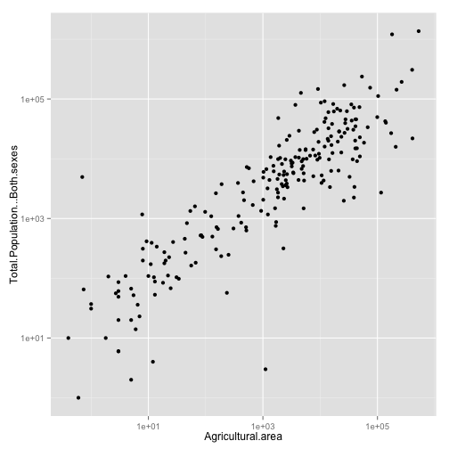
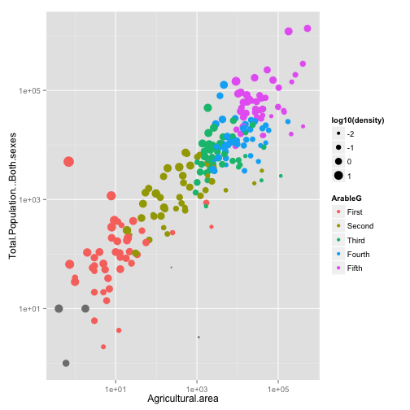

Food and Agriculture Organization Data
======================


The `FAOsimple` dataset provides a quick introduction to "big" data.  The structure of the data set is very simple:
* Cases are countries
* Variables relate to different measures of land use and population size. 

### Starting with Graphics

We use it as a starting point for making graphics, particularly scatter plots.

### Reading in the Data

As part of the `DCF` package, it's easy to read in the data.

```r
data(FAOsimple)
```

There are 224 cases, which turn out to be countries.

```r
nrow(FAOsimple)
```

```
## [1] 224
```

There are 52 variables, of which a few are listed here --- the complete list is below:

```r
head(names(FAOsimple))
```

```
## [1] "Country"                                   
## [2] "Year"                                      
## [3] "Agricultural.area"                         
## [4] "Agricultural.area.certified.organic"       
## [5] "Agricultural.area.in.conversion.to.organic"
## [6] "Agricultural.area.irrigated"
```


Here are a few of the countries: Libya, Togo, Mexico, Lithuania, Ireland, Venezuela (Bolivarian Republic of), Myanmar, Trinidad and Tobago, Namibia, Comoros.  There are 224 altogether.

### Making Scatterplots

Students can explore the relationship among variables with a simple scatterplot, for instance this one about total population as a function of agricultural area.

```r
ggplot(data = FAOsimple, aes(x = Agricultural.area, y = Total.Population...Both.sexes)) + 
    geom_point() + scale_x_log10() + scale_y_log10()
```

```
## Warning: Removed 2 rows containing missing values (geom_point).
```

 


Evidently, there's a pretty simple typical relationship between agricultural area and population.  To acquaint students with such graphics, some questions to ask:
* For an area of 1000 km^2, what's the typical population?
* There are some outliers.  Which points would you identify as such?
* Neglecting the outliers, for a given agricultural area, there is a range of populations.  How big is that range?

To explore the graphics yourself, use the `mScatter()` function, which let's you interactively choose the variables to be plotted as well as other aspects of the plot.  Here's how:

```r
require(DCF)
data(FAOsimple)
mScatter(FAOsimple)
```


In addition to choosing variables for the $x$ and $y$ axes, you can choose variables for color and size of the dot.  Doing so in a meaningful way involves an additional data technique: Generating a new variable from existing variables.

### Transformations of variables

Often, you create new variables by transforming old ones.  

Some transformations are arithmetic, for example,  creating population density by dividing population by land area:

```r
FAOsimple = transform(FAOsimple, density = Total.Population...Both.sexes/Country.area)
```


When using colors to indicate the level of a variable, it can be helpful to divide into discrete groups.  A particularly simple-to-use transformation divides up the cases into groups of (approximately) equal size.  This is  useful when dealing with variables that have an uneven distribution over a very wide range.

```r
FAOsimple = transform(FAOsimple, ArableG = ntiles(Arable.land, n = 5))
```


Here's a plot that uses these transformed variables for color and size of the dots:

```r
ggplot(data = FAOsimple, aes(x = Agricultural.area, y = Total.Population...Both.sexes)) + 
    geom_point() + aes(colour = ArableG) + aes(size = log10(density)) + scale_x_log10() + 
    scale_y_log10()
```

```
## Warning: Removed 2 rows containing missing values (geom_point).
```

 


#### Interpretation Task:

Examine the plot above and describe the features of the plot that support these claims:
1. The amount of arable land is roughly aligned with agricultural area.
2. Countries with low population densities tend to have relatively large agricultural areas compared to the amount of arable land.


#### Exercises

Construct new variables

* Calculate population density as population per agricultural area
* Add up the male and female population and verify that it matches total population. (You can make a new variable and plot it against the original total population.)


```r
# Your plot here
```


#### Exploration
 
Is there a clear relationship between the fraction of a country's total land that is arable and the fraction of a country's total population that is engaged in agricultural work?


```r
# Your plot goes here
```


Pick out some variables that you think ought to be related. Describe the relationship you hypothesize and then demonstrate whether or not your hypothesis is consistent with the data.


```r
# Your plot here
```


Show a situation where the use of logarithmic axes helps to illustrate a relationship. Do this by contrasting the same plots with and without logarithmic axes and then providing a narrative explanation of what the logarithmic axes make clearer.

```r
# Your plot without logarithmic axes
```


```r
# The same plot with logarithmic axes
```


Your narrative goes here ...


## FAO Variable Names


```r
names(FAOsimple)
```

```
##  [1] "Country"                                                     
##  [2] "Year"                                                        
##  [3] "Agricultural.area"                                           
##  [4] "Agricultural.area.certified.organic"                         
##  [5] "Agricultural.area.in.conversion.to.organic"                  
##  [6] "Agricultural.area.irrigated"                                 
##  [7] "Agricultural.area.organic..total"                            
##  [8] "Arable.land"                                                 
##  [9] "Arable.land.and.Permanent.crops"                             
## [10] "Arable.land.area.certified.organic"                          
## [11] "Arable.land.area.in.conversion.to.organic"                   
## [12] "Arable.land.organic..total"                                  
## [13] "Country.area"                                                
## [14] "Fallow.land"                                                 
## [15] "Forest.area"                                                 
## [16] "Inland.water"                                                
## [17] "Land.area"                                                   
## [18] "Other.land"                                                  
## [19] "Perm..crops.irrigated"                                       
## [20] "Perm..crops.non.irrigated"                                   
## [21] "Perm..meadows...pastures...Cultivated"                       
## [22] "Perm..meadows...pastures...Nat..grown"                       
## [23] "Perm..meadows...pastures.Cult....irrig"                      
## [24] "Perm..meadows...pastures.Cult..non.irrig"                    
## [25] "Permanent.crops"                                             
## [26] "Permanent.crops.area.certified.organic"                      
## [27] "Permanent.crops.area.in.conversion.to.organic"               
## [28] "Permanent.crops.organic..total"                              
## [29] "Permanent.meadows.and.pastures"                              
## [30] "Permanent.meadows.and.pastures.area.certified.organic"       
## [31] "Permanent.meadows.and.pastures.area.in.conversion.to.organic"
## [32] "Permanent.meadows.and.pastures.organic..total"               
## [33] "Temp..crops.irrigated"                                       
## [34] "Temp..crops.non.irrigated"                                   
## [35] "Temp..meadows...pastures.irrigated"                          
## [36] "Temp..meadows...pastures.non.irrig."                         
## [37] "Temporary.crops"                                             
## [38] "Temporary.meadows.and.pastures"                              
## [39] "Total.area.equipped.for.irrigation"                          
## [40] "Agricultural.population"                                     
## [41] "Female.economically.active.population"                       
## [42] "Female.economically.active.population.in.Agr"                
## [43] "Male.economically.active.population"                         
## [44] "Male.economically.active.population.in.Agr"                  
## [45] "Non.agricultural.population"                                 
## [46] "Rural.population"                                            
## [47] "Total.economically.active.population"                        
## [48] "Total.economically.active.population.in.Agr"                 
## [49] "Total.Population...Both.sexes"                               
## [50] "Total.Population...Female"                                   
## [51] "Total.Population...Male"                                     
## [52] "Urban.population"                                            
## [53] "density"                                                     
## [54] "ArableG"
```

