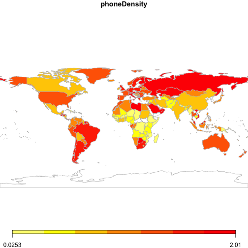

Gapminder Data
======================


```r
worldMap <- function(form, data = NULL, region = c("World", "Eurasia", "Africa", 
    "Latin America", "North America", "Oceania", "Asia")) {
    cname <- all.vars(rhs(form))
    vname <- all.vars(lhs(form))
    region <- tolower(match.arg(region))
    s <- joinCountryData2Map(data, joinCode = "NAME", nameJoinColumn = cname)
    par(mai = c(0, 0, 0.2, 0), xaxs = "i", yaxs = "i")
    mp <- mapCountryData(s, nameColumnToPlot = vname, addLegend = FALSE, mapRegion = region)
    do.call(addMapLegend, c(mp, legendWidth = 0.5, legendMar = 2))
}
```

The <gapminder.org/data> site provides access to more than 500 country-by-country "indicator" variables.

In the *Data and Computing Fundamentals* course, we use these data for several purposes:
* Illustrate wide versus long format
* Demonstrate grouping operations
* Demonstrate joining operations
* Visualization, especially maps and scatter plots
* Modeling, especially clustering

Eventually, we plan to write interface software to get data directly from the Gapminder site, but for the present we have downloaded a subset of data and provided access through the `fetchData()` and `fetchGapminder()` functions.

The list of available files is [here](http://htmlpreview.github.io/?https://github.com/dtkaplan/DataAndComputingFundamentals/blob/master/Notes/Day3/GapminderFiles.html), along with instructions for adding new files.

### Wide vs Long

The Gapminder data are originally stored with countries being the cases and years the "variables."  For example, here is the data on cell phone subscriptions (only part of the data is shown):

```r
phones <- fetchData("Gapminder/CellPhoneTotal.csv")
```

```
## Retrieving from
## http://www.mosaic-web.org/go/datasets/Gapminder/CellPhoneTotal.csv
```

```
##   Mobile.cellular.subscriptions..total.number    X2009    X2010    X2011
## 1                                    Abkhazia       NA       NA       NA
## 2                                 Afghanistan 10500000 13000000 17558265
## 3                       Akrotiri and Dhekelia       NA       NA       NA
## 4                                     Albania  2463741  2692372  3100000
## 5                                     Algeria 32729824 32780165 35615926
## 6                              American Samoa       NA       NA       NA
```


This is a "wide" format.  In this presentation, there is a separate variable for each year --- 2009, 2010, and 2011 are shown.  Under that year, the value gives the number of cell phone subscriptions.

Although the wide format is reasonable, it has disadvantages.  In particular, it can be hard to do comparisons across countries, except for the same year.

The "narrow" format of these same data has three rows: country, cell phone number, and year.  Converting between wide and narrow formats is not difficult, but to simplify things, we have presented a function that does the conversion automatically:

```r
phones <- fetchGapminder("Gapminder/CellPhoneTotal.csv")
```

```
## Retrieving from
## http://www.mosaic-web.org/go/datasets/Gapminder/CellPhoneTotal.csv
```

```
##           Country Year CellPhoneTotal
## 12102 Afghanistan 2009       10500000
## 12104     Albania 2009        2463741
## 12105     Algeria 2009       32729824
## 12111   Argentina 2009       52482780
## 12113       Aruba 2009         128000
## 12377 Afghanistan 2010       13000000
## 12379     Albania 2010        2692372
## 12380     Algeria 2010       32780165
## 12386   Argentina 2010       53700000
## 12388       Aruba 2010         131800
## 12652 Afghanistan 2011       17558265
## 12654     Albania 2011        3100000
## 12655     Algeria 2011       35615926
## 12661   Argentina 2011       55000000
```


To a human reader, this format is not necessarily easier than the wide format. But with grouping and joining operations, it's considerably easier.

For instance, suppose you're interested in the fraction of the population with cell phone subscriptions.  You'll want to read in both the phone and the population data, sorting them out year-by-year for each country.  Then divide subscriptions by population to get an index, and perhaps display this as a map.  But not every country has a reading for every year, so perhaps best to look at the maximum number reported for the period since 2005.


```r
phones <- fetchGapminder("Gapminder/CellPhoneTotal.csv")
phonemax <- groupBy(phones, by = Country, phones = max(CellPhoneTotal))
pop <- fetchGapminder("Gapminder/TotalPopulation.csv")
# Bad formatting by Gapminder
pop <- transform(pop, pop = as.numeric(gsub(",", "", TotalPopulation)))
popmax <- groupBy(pop, by = Country, pop = max(pop, na.rm = TRUE))
both <- join(popmax, phonemax)
both <- subset(both, phones > 0)
both <- transform(both, phoneDensity = phones/pop)
```


Mapping out the number of subscriptions per population shows some expected and some perhaps unexpected patterns, such as the large density in countries such as Chile, Argentina, Libya, South Africa, Zimbabwe, etc.

```r
worldMap(phoneDensity ~ Country, data = both)
```

```
## 190 codes from your data successfully matched countries in the map
## 5 codes from your data failed to match with a country code in the map
## 53 codes from the map weren't represented in your data
```

 


